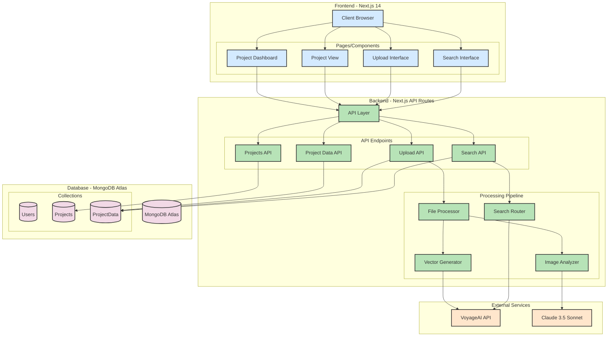

# Architecture Diagram Explanation

## Component Overview

### Frontend Layer
- **Client Browser**: Entry point for user interactions
- **Pages/Components**: Next.js 14 pages and components for different functionalities
  - Project Dashboard
  - Project View
  - Upload Interface
  - Search Interface

### Backend Layer
- **API Layer**: Next.js API routes handling various endpoints
- **Processing Pipeline**: 
  - File Processor: Handles file uploads and initial processing
  - Vector Generator: Creates embeddings using VoyageAI
  - Image Analyzer: Processes images using Claude
  - Search Router: Manages search requests and vector similarity

### External Services
- **VoyageAI API**: Generates embeddings for vector search
- **Claude 3.5 Sonnet**: Provides image analysis and response generation

### Database Layer
- **MongoDB Atlas**: Primary database with vector search capabilities
- **Collections**:
  - Users: Stores user information
  - Projects: Manages project metadata
  - ProjectData: Vector-enabled collection for processed data

## Data Flow

1. **Upload Flow**:
   - User uploads file → Upload Interface
   - File processed by File Processor
   - Vector Generator creates embeddings via VoyageAI
   - Image Analyzer processes with Claude
   - Data stored in ProjectData collection

2. **Search Flow**:
   - User inputs query → Search Interface
   - Search Router processes query
   - Vector embedding generated via VoyageAI
   - Vector search performed in MongoDB
   - Results processed and returned to user

## Key Features

- Vector search integration with MongoDB Atlas
- Real-time processing pipeline
- Scalable architecture
- Separation of concerns
- RESTful API design
